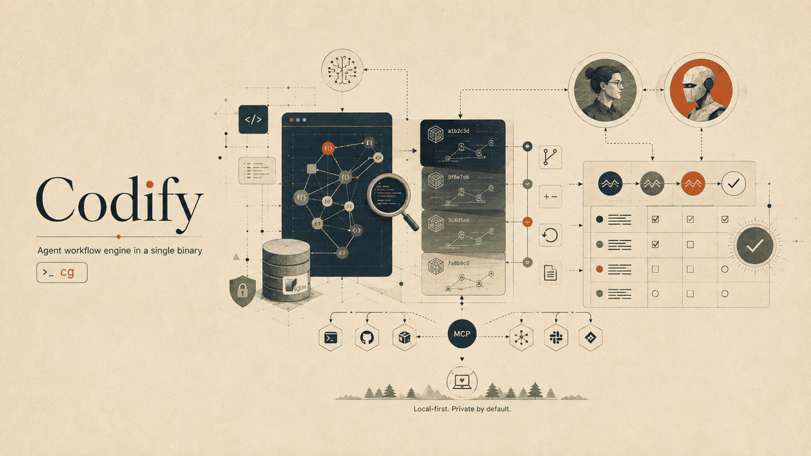

<div align="center">

# Codify



**La herramienta de flujo de trabajo para agentes que escala de proyectos pequeños y simples a bases de código grandes y complejas.**

C11 puro. Un solo binario. Una sola base de datos SQLite. Nada sale de tu máquina.

[](../../LICENSE)
[](#)
[](../../.github/workflows/ci.yml)

[English](../../README.md) · [简体中文](README.zh-CN.md) · [Español](README.es.md) · [हिन्दी](README.hi.md) · [العربية](README.ar.md) · [Français](README.fr.md) · [Português (BR)](README.pt-BR.md)

</div>

---

## Descripción general

Codify (se invoca como `cg`) es un motor de flujo de trabajo para agentes en un solo binario. Mantiene las cuatro cosas que un proyecto necesita más allá del propio código — qué **es** el código, cómo llegó **hasta aquí**, qué viene **después** y qué se **aprendió** por el camino — y las sirve por igual a humanos y a agentes de IA.

La versión 1.1.0 (v11) convierte la flota en algo a lo que entregas una spec y dejas funcionando: `cg fleet up` arranca un supervisor duradero y reanudable tras un fallo que ejecuta a la vez el agente principal, un gestor por funcionalidad y trabajadores por tarea, y gestiona cada proceso de Codex o Claude Code hasta que su trabajo queda cualificado y fusionado. Los agentes reciben briefings desde el grafo, la deriva entre ramas se detecta antes de fusionar, cada cambio de estado queda en un registro de eventos y `cg serve` lo envía todo al editor por una sola conexión. Se apoya en los cimientos de la flota: un único indexador que agrupa pasadas en lugar de cincuenta, la jerarquía Main Gideon / gestor de funcionalidad / trabajador con su flujo de ramas, merges, PR y checkpoints, un grafo unificado para todas las ramas y worktrees, y las decisiones de Jev — la única llamada remota de una herramienta por lo demás local.

**Qué es el código.** Codify indexa 19 lenguajes en un grafo consultable: símbolos, aristas de llamadas, rutas conscientes del framework y búsqueda instantánea de texto completo, todo almacenado localmente en SQLite. `cg context <consulta>` responde a "ponme al día sobre esta zona" en una sola llamada. Y más allá de lo que ve un parser, los comentarios se indexan como nodos de primera clase — la capa de intención: propósito, contratos, peligros y los acoplamientos que solo viven en prosa.

**Cómo llegó hasta aquí.** Un sistema integrado de instantáneas direccionadas por contenido te da commits, historial, diffs y restauración sin necesidad de un VCS externo; `cg changes` informa del radio de impacto de tus ediciones sin confirmar. `cg changelog` redacta las notas de versión: por defecto a partir del historial de git — una versión por tag o por cambio de número de versión, grupos según el prefijo del asunto del commit, la referencia a la tarea conservada y, con una clave, un breve párrafo de Highlights escrito por un modelo — y a partir de la cadena de instantáneas, con diffs a nivel de símbolo, con `--snapshots` o si el proyecto no usa git.

**Qué viene después.** Un motor de specs convierte archivos kvx en texto plano en un plan operativo: un tablero de tareas con oleadas de dependencias, criterios de aceptación en cada tarea — y un `done` que se verifica, no se afirma. `cg spec new` y `cg spec add` crean el plan, `cg spec lint` demuestra que es ejecutable y el ciclo lo ejecuta. En modo Prod, `implemented` registra que el código está terminado sin afirmar la cualificación; solo `done` significa que la cualificación ejecutable y las comprobaciones del grafo pasaron. En modo paralelo trabajan varios agentes a la vez, limitados por la disjunción de las rutas que declara cada tarea.

**Qué se aprendió por el camino.** Una memoria de agente almacena notas deliberadas — decisiones, restricciones, resultados, preferencias, hechos — en la misma base de datos que el grafo, vinculadas a la tarea bajo la que se tomaron. `cg remember` guarda una a mitad de tarea, cada `cg spec done` registra automáticamente un resultado honesto (incluidos los rechazos) y `cg recall` lo recupera todo, ordenado por relevancia y actualidad. Las capas se refuerzan entre sí: los commits se etiquetan con la tarea que implementan, las memorias afloran en su tarea, `cg why` lleva un símbolo hasta las decisiones que hay detrás y `cg spec trace` recorre cualquier tarea hasta sus símbolos, commits y memorias.

**Y está presente entre los pasos, no solo en ellos.** `cg work open` empieza con un paquete compacto de la tarea, `cg work update` devuelve solo los deltas nuevos de estado, evidencia y espacio de trabajo, `cg event progress` clasifica los bucles sin confundir actividad con progreso y `cg guard` detecta cuándo una edición se sale del alcance declarado. Un servidor MCP integrado expone 57 herramientas, recursos y prompts a cualquier agente compatible con MCP, mientras `cg integrate` planifica, aplica y diagnostica la configuración nativa de cada host.

**Y dirige agentes, no solo los sirve.** `cg handoff` y `cg resume` pasan una tarea entre sesiones sin perder estado, `cg spec claim-next` entrega atómicamente a un agente ocioso la siguiente tarea sin conflictos y `cg spec run` reparte una oleada entera entre sesiones de Codex CLI o Claude Code — un proceso hijo aislado por tarea reclamada, con logs y prompts en disco y leases liberados si falla.

**Y sobrevive a una flota.** Indexar es un recurso compartido: el primer `cg` que necesita una pasada la ejecuta, los demás dejan una nota y se agrupan en ella, una ventana de frescura se salta el recorrido por completo y unos slots de parseo a nivel de máquina mantienen los proyectos concurrentes dentro del presupuesto de núcleos ([docs/sync.md](../../docs/sync.md)). Encima, `spec/workflow.kvx` puede declarar una jerarquía — un agente principal dueño de la lista de tareas, un gestor por funcionalidad y trabajadores por oleada — y `cg fleet` dirige el flujo de ramas: worktree, merge hacia arriba, aterrizaje tras las puertas de test y lint, pull request, checkpoint. `cg fleet up` ejecuta el árbol entero por sí solo bajo un supervisor desacoplado: varias funcionalidades a la vez, cada trabajador en su propio worktree, empujando a los agentes atascados, reintentando los fallidos con lo que salió mal, escalando lo que no tiene arreglo, deteniéndose en las puertas de aprobación que activaste y dando el trabajo por completo cuando se **fusionó**, no cuando un proceso terminó ([docs/hierarchy.md](../../docs/hierarchy.md)). Si matas el supervisor, `cg fleet up --resume` adopta a los agentes que siguen vivos. La deriva respecto a la spec, las tareas que chocan y los cambios de interfaz de los que dependen otras ramas se señalan antes de fusionar ([docs/drift.md](../../docs/drift.md)), y cada cambio es un evento que `cg events --follow` y `cg serve` transmiten en vivo ([docs/events.md](../../docs/events.md)). Todos comparten un grafo y una memoria: cada rama y worktree enlazado se indexa en el mismo `.codegraph/`, separado por rama ([docs/branches.md](../../docs/branches.md)).

**Y pide una decisión cuando hace falta.** `cg jev` consulta el modelo System One de TypeSafe para juicios tipados — verdadero/falso, uno de varios, ordenado. `cg memory classify` lo usa para decir qué notas son skills reutilizables, y `cg skills promote` las convierte en `.agents/skills/<slug>/SKILL.md` portables; un `verify_cmd` fallido recibe una línea de triaje, los hallazgos de `cg guard` se ordenan y un pull request recibe una puntuación de preparación. Es la única llamada remota que hace Codify: obligatoria para las funciones construidas sobre ella, nunca para el ciclo principal y nunca autoritativa — ninguna respuesta de Jev ha cambiado jamás un código de salida ([docs/jev.md](../../docs/jev.md)).

**Y la documentación es la última tarea verificada.** Las specs nuevas activan por defecto una etapa de cierre `@docs`. Cuando todas las tareas ordinarias están cualificadas, Codify construye un paquete de evidencia acotado; el mismo conector de agente actualiza la documentación de usuario y de desarrollador, `cg docs check` comprueba referencias, enlaces locales, cobertura del grafo y alcance, y `cg docs close` registra una instantánea `[spec:<feature>/@docs]` y una línea base incremental. Estas comprobaciones estructurales apoyan la revisión; no certifican el significado de cada frase.

No hay servicios en segundo plano que no hayas iniciado ni telemetría — el supervisor de la flota solo corre tras `cg fleet up` y se detiene con `cg fleet down`. El grafo, la memoria, las instantáneas y todo el ciclo de tareas se ejecutan en tu máquina y se quedan ahí. Hay dos excepciones, explícitas y opcionales: las decisiones de Jev necesitan `OPENROUTER_API_KEY`, y solo los comandos construidos sobre ellas hacen esa llamada; y `cg changelog` pide a un modelo los highlights de cada versión solo cuando `CENTRA_API_KEY` (o `CG_CHANGELOG_KEY`) está definida.

## Por qué Codify

- **Cierra el ciclo del plan a la prueba.** Codify planifica el trabajo y describe el código contra la misma base de datos: cuando una tarea declara que introduce `checkMode` y toca `src/*.ts`, `cg spec done` se niega a completarla hasta que el grafo y el historial coincidan.
- **Los agentes trabajan como ingenieros, no como turistas.** Piden a `cg spec next` qué hacer, a `cg context` todo sobre la zona y a `cg impact` quién se rompe, y confirman con atribución automática de la tarea — todo también por MCP.
- **El proyecto recuerda lo que las sesiones olvidan.** Una decisión escrita con `cg remember` reaparece en `cg spec next`, `cg spec start` y `cg recall`; las completaciones rechazadas también se registran.
- **El contexto llega en una llamada, dentro de un presupuesto.** `cg context` devuelve memorias, puntos de entrada, coincidencias, llamadores, llamados y rutas, ordenados y ajustados a `--budget` (por defecto 4000 tokens), con un recuento explícito de lo omitido.
- **Impacto y búsqueda de primera clase.** `cg impact <nombre> -d 3` recorre llamadores y llamados transitivamente; un índice FTS5 de trigramas y un índice de palabras hacen la búsqueda instantánea.
- **El índice nunca queda obsoleto — ni se desborda.** `cg watch` sincroniza con eventos nativos del sistema operativo (inotify, FSEvents, ReadDirectoryChangesW); con cincuenta agentes, un proceso recorre y los demás se agrupan en su pasada.
- **Se adapta al hardware.** `cg` dimensiona trabajadores y cachés de SQLite según núcleos conscientes de contenedores, la RAM realmente disponible y el coste medido; `cg info` lo muestra.
- **Todo permanece local.** El grafo y las instantáneas viven bajo `.codegraph/`. Borra el directorio y desaparece todo rastro.

## La capa de intención

Un parser ve símbolos, llamadas y rutas, pero no *por qué* existe una función, qué deben garantizar sus llamadores o que `save_tasks` debe ejecutarse después de que `load_tasks` lea el disco — esa mitad del código solo vive en los comentarios. Codify la indexa ([docs/ANCHORS.md](../../docs/ANCHORS.md) es la convención completa); nada es obligatorio, y un repositorio que nunca adopte la convención obtiene igualmente captura, survey y aristas blandas de los comentarios existentes:

- **Anclas**: comentarios que pasan la prueba de derivabilidad — *si un agente pudiera haberlo escrito leyendo el código, no es un ancla.* Cuatro tipos valen la pena: **propósito**, **contrato**, **peligro**, **puntero**.
- **Recuperación doc-first**: donde hay un ancla, `cg context` sirve doc + firma en lugar del cuerpo — varias veces más símbolos por presupuesto.
- **`cg survey`** lee cien archivos por el precio de un cuerpo: líneas de propósito y docs con firmas, nunca cuerpos.
- **Aristas blandas**: los nombres dentro de las anclas se resuelven como referencias `(soft)`, acoplamientos que ningún parser puede derivar.
- **Honestidad ante la deriva**: cuando el código cambia, el doc se marca obsoleto en `cg check`, `cg guard` y la recuperación. Avisa, no bloquea.
- **`cg anchors`** ordena los símbolos sin cubrir por puntuación de coordinación para empezar por los puntos de orquestación.

## Una sesión con Codify

```sh
cg brief                      # raíz, tarea activa + criterios, trabajo sin confirmar, decisiones previas
cg spec next                  # la siguiente tarea elegible, criterios + memorias relevantes
cg spec start 16.7            # reclámala — una sola tarea en curso a la vez
cg context "password auth"    # memorias, puntos de entrada, símbolos, llamadores, rutas en una llamada
cg why verifyLogin            # quién lo cambió, bajo qué tarea y qué se decidió
cg impact verifyLogin -d 2    # quién se rompe si esto cambia
# ...implementar...
cg guard                      # ¿algo se sale de lo que declaró la tarea 16.7?
cg test-impact                # qué tests cubren lo que acabas de cambiar
cg remember "sessions rotate on login" --type decision   # vinculada a la tarea 16.7
cg review                     # el cambio, junto a los criterios que dice cumplir
cg commit -m "add password auth"   # instantánea, etiquetada automáticamente [spec:ion_spec/16.7]
cg spec done 16.7             # cualificación: verify_cmd + comprobaciones del grafo; resultado registrado
cg spec trace 16.7            # la prueba: tarea -> símbolos -> commits -> memorias
```

Y cuando una sesión tiene que parar antes de terminar — la ventana de contexto está llena, se acabó el día — el trabajo no se evapora:

```sh
# sesión A, parando antes de tiempo
cg handoff --done "schema migration; token rotation" \
           --next "wire the login route; extend 03_auth test" \
           --blocked "flaky fixture on CI" -m "rotate on login, not refresh"

# sesión B, horas después, con una ventana de contexto nueva
cg resume --prompt            # bloque listo para pegar: tarea, pasos hechos, bloqueos,
                              # siguientes pasos, archivos sin confirmar, estado del lease
```

Un handoff se guarda como memoria estructurada vinculada a la tarea; cada uno sustituye al anterior, así que `cg resume` siempre encuentra el estado más reciente. Cada comando del ciclo es también una herramienta MCP, `cg check` ejecuta toda la puerta en CI en un solo paso y `cg hook install` conecta la sincronización y la comprobación de alcance para que casi todo ocurra sin invocarlo.

## Lenguajes y frameworks compatibles

**Lenguajes:** TypeScript, JavaScript, Python, Go, Rust, Java, C#, VB.NET, PHP, Ruby, C, C++, Swift, Kotlin, Erlang, Solidity, Svelte, Vue, Astro.

**Rutas conscientes del framework:** `cg` vincula patrones de URL con sus manejadores en Express, Koa, Fastify, Hapi, NestJS, Next.js, SvelteKit, Flask, FastAPI, Django, Rails, Sinatra, Laravel, Spring, ASP.NET, Gin, Echo, Fiber, Chi, Actix y Axum.

## Instalación

Linux x86_64 — un solo comando instala (o actualiza) un binario estático verificado por checksum:

```sh
curl -fsSL https://codify.centra.ag/install | bash
```

Para desinstalar: `curl -fsSL https://codify.centra.ag/uninstall | bash`. Los datos `.codegraph/` de cada proyecto nunca se tocan. Las actualizaciones son seguras en proyectos existentes: la base de datos lleva una versión de esquema y, en la primera apertura tras actualizar, `cg` reconstruye solo las tablas de índice derivadas (archivos, símbolos, referencias, rutas, imports e índices de búsqueda), que la siguiente sincronización vuelve a llenar. Una migración nunca elimina memorias, historial de git ni leases.

En cualquier otra plataforma, compila desde el código fuente (dependencias: un compilador de C y `libsqlite3-dev`), y después inicializa cualquier proyecto:

```sh
make && sudo make install
cd your-project && cg init
```

## Referencia de comandos

### Grafo

| Comando | Descripción |
|---|---|
| `cg init [--nested]` | Crea `.codegraph/` y construye el índice inicial; dentro de un worktree enlazado, se une al grafo compartido bajo esta rama |
| `cg sync [paths] [--max-age MS] [--background] [--wait MS]` | Índice incremental: se agrupa con una pasada en curso, se omite si está fresco. `cg index [--full]` es la forma bloqueante |
| `cg branches` | Cada rama indexada en el grafo compartido, con su worktree, head, base y número de archivos |
| `cg search <q> [-n N]` | Búsqueda de símbolos y de texto completo |
| `cg symbol <name>` | Definición, fragmento y recuento de referencias |
| `cg impact <name> [-d N] [--budget N]` | Llamadores y llamados transitivos, ajustados a un presupuesto (por defecto 8000) |
| `cg context <q> [--budget N] [-n K]` | Paquete de contexto en una llamada: memorias, símbolos, puntos de entrada, rutas (por defecto 8 símbolos, 4000 tokens) |
| `cg survey [path\|query] [--budget N]` | Líneas de propósito y docs con firmas en ~100 archivos por llamada, nunca un cuerpo (presupuesto por defecto 16000) |
| `cg anchors [--stale] [--uncovered]` | Salud de las anclas: docs obsoletos y símbolos sin cubrir ordenados por puntuación de coordinación |
| `cg routes [filter]` | Tabla de patrón de URL a manejador |
| `cg why <symbol>` | Procedencia: commits que lo cambiaron, tareas que implementaron, decisiones registradas |
| `cg test-impact [symbol]` | Tests que referencian un símbolo, o todos los símbolos de tus cambios sin confirmar |
| `cg watch [--debounce MS]` | Sincronización automática con eventos nativos del sistema de archivos |
| `cg root` / `cg info` | La raíz del proyecto que resuelve `cg`; perfil de la máquina, dimensionado de la tubería y rama |

### Control de versiones

Las instantáneas se direccionan por contenido con SHA-256 y los blobs se deduplican. No sustituyen a git: se respeta `.gitignore` junto a `.cgignore`, `cg git-sync` lee tu historial real y `cg commit --git` escribe en ambos.

| Comando | Descripción |
|---|---|
| `cg commit -m <msg>` | Instantánea del árbol de trabajo; `--git` crea además un commit de git real con la misma etiqueta de spec |
| `cg log` / `cg status` | Historial, y árbol de trabajo frente a HEAD |
| `cg diff [A] [B]` | Diff de líneas LCS entre instantáneas o contra el árbol de trabajo |
| `cg checkout <id> [--force]` | Restaura una instantánea |
| `cg changes [--limit N]` | Radio de impacto de las ediciones sin confirmar: símbolos tocados más sus llamadores externos |
| `cg git-sync [-n N]` | Ingiere el historial de git — commits, autores, churn por archivo — que luego ordena búsqueda y contexto |
| `cg events [--since N] [--kind K,..] [-n N] [--follow [--for S]] [--head]` | El registro de eventos: cada cambio de tarea, claim, intento, agente, flota, supervisor, deriva y aprobación por número de secuencia. `--kind` admite prefijos (`fleet.`), `--follow` transmite. Ver [docs/events.md](../../docs/events.md) |

### Changelog

`cg changelog` genera notas de versión a partir del historial de git. Una versión empieza en un tag **o** en el commit que cambió la versión del proyecto — `CG_VERSION` en `src/cg.h`, un archivo `VERSION` o `package.json` — así que un proyecto sin tags obtiene igualmente una sección por versión. Lo que viene después de la última recibe el nombre de la versión que lleva el árbol de trabajo si es nueva, el de `--tag NAME`, y solo en otro caso `[Unreleased]`. Cada grupo es el prefijo del asunto del commit, y el `[spec:<feature>/<task>]` que añade `cg commit` se convierte en una referencia a la tarea.

**Highlights.** Con `CENTRA_API_KEY` en el entorno o en el `.env` del proyecto (o `CG_CHANGELOG_KEY`), cada versión recibe además un bloque `### Highlights` escrito por un modelo a partir de sus commits agrupados; las viñetas derivadas nunca cambian y el prompt prohíbe inventar. `CG_CHANGELOG_ENDPOINT` y `CG_CHANGELOG_MODEL` lo apuntan a cualquier endpoint compatible con OpenAI. Las respuestas se cachean en `.codegraph/changelog-cache/`, así que regenerar solo pregunta por las versiones que cambiaron. `--summarize` lo exige, `--no-summarize` deja fuera al modelo y una llamada fallida imprime `highlights for <release> skipped — <why>` en stderr. `-n N` limita las secciones, `-o FILE` escribe relativo a la raíz del repositorio, `--unreleased` emite solo la sección más reciente y `--tag 1.2.0` le da nombre con fecha de hoy. `--snapshots`, o un proyecto sin `.git`, recurre al renderizador de instantáneas con diffs a nivel de símbolo. `cliff.toml` es la configuración equivalente de [git-cliff](https://git-cliff.org), que solo conoce tags. El `CHANGELOG.md` de este repositorio se genera con `cg changelog -o CHANGELOG.md`.

### Memoria

Notas duraderas para agentes, en la misma base de datos SQLite que el grafo. Las memorias escritas durante una tarea de spec se vinculan a ella y `cg spec done` registra los resultados automáticamente. Nunca almacenes secretos en ellas. Una memoria sustituida nunca se borra: simplemente deja de encabezar los resultados. Los archivos de skill promovidos llevan la marca de propiedad de Codify y un enlace a la memoria; un archivo sin esa marca nunca se sobrescribe ([docs/jev.md](../../docs/jev.md#memory-classification-and-skills)).

| Comando | Descripción |
|---|---|
| `cg remember <text>` | Guarda una memoria — `--type decision\|constraint\|outcome\|preference\|fact` (por defecto `fact`), `--task <feature/id>`, anclas `--symbols` / `--files`, `--supersedes <id>` para retirar una decisión revertida |
| `cg recall [query]` | Busca memorias por relevancia y actualidad; filtra con `--task`, `--type`, `-n N` o `--near <file>` |
| `cg forget <id>` / `cg memory compact` | Elimina una memoria; fusiona duplicadas (`--dry-run` para previsualizar) |
| `cg memory classify [<id>\|--all\|--unclassified]` | Pregunta a Jev qué es cada nota — `skill`, `decision`, `constraint`, `fact`, `noise` — con una confianza, y la guarda en la memoria |
| `cg skills list\|promote <id>\|render` | Las memorias clasificadas como `skill`, promovidas a `.agents/skills/<slug>/SKILL.md` y mantenidas al día con su nota |

### Agentes

| Comando | Descripción |
|---|---|
| `cg mcp` | Servidor MCP por stdio: 57 herramientas, más recursos y prompts |
| `cg lsp` | Language Server por stdio — para cualquier editor, no solo VS Code |
| `cg serve` | Una conexión JSON-RPC (stdio) para un editor: cada herramienta MCP, cualquier comando `cg` (`exec`), `cancel` y suscripciones a eventos enviados desde un número de secuencia. Inactivo, no retiene ningún bloqueo. Ver [docs/events.md](../../docs/events.md#cg-serve) |
| `cg tool list \| call <name> [json]` | Ejecuta una herramienta MCP desde la shell, sin cliente MCP |
| `cg integrate detect\|plan\|apply\|doctor` | Configuración para Codex, Claude Code, Copilot/VS Code, Cursor, Gemini CLI, OpenCode, Zed, Windsurf, Cline y Continue; planificar es de solo lectura, aplicar es idempotente y con copia de seguridad |
| `cg mcp-install` | Alias de compatibilidad de `cg integrate apply` |
| `cg hook install` / `cg hook post-edit` | Conecta hooks de agente y git; el hook de edición hace una sincronización dirigida y un guard de la ruta editada |
| `cg changelog [-n N] [-o FILE] [--unreleased] [--tag NAME] [--snapshots] [--summarize\|--no-summarize]` | Notas de versión desde git, una versión por tag o cambio de versión, con Highlights de un modelo si `CENTRA_API_KEY` está definida (ver [Changelog](#changelog)) |
| `cg agentmd [--write]` | Genera la orientación del grafo en `.codify/agent-context.md`; `AGENTS.md` y `CLAUDE.md` siguen siendo de `cg spec render` |

### Plano de control de agentes

Codify mantiene explícitas cuatro autoridades independientes: el estado de Git, el de las instantáneas de Codify, el estado declarado de la spec y los intentos vivos. `cg state` las muestra juntas sin tratar una como prueba de otra; `cg spec reconcile` diagnostica declaraciones huérfanas y solo modifica con `--repair`. Los hooks nativos alimentan `cg event ingest`, y `cg event progress` clasifica fallos repetidos, observaciones repetidas, oscilaciones A-B y ventanas sin evidencia; la recuperación es finita y consultiva salvo que `CG_PROGRESS_ENFORCE=1` la haga terminal. `cg work open` compone objetivo, criterios, alcance, memorias y contexto en un paquete, `cg work update` devuelve solo lo cambiado y `cg work close` empareja cada criterio con evidencia o lo marca sin verificar.

### Gobernanza

Todos avisan por defecto; solo `--strict` los hace fallar. Todos los comandos de consulta aceptan `--json`; ese flag, el servidor MCP y el language server son las interfaces nativas para agentes.

| Comando | Descripción |
|---|---|
| `cg brief` | Estado de la sesión en una llamada: raíz, tarea activa con sus criterios, rutas sin confirmar, decisiones recientes |
| `cg review` | El cambio junto a lo que afirma: símbolos cambiados, llamadores en riesgo y criterios de aceptación |
| `cg guard [paths] [--strict]` | Ediciones fuera del alcance declarado en `touches` por la tarea en curso |
| `cg drift check <id> [--base REF] \| collisions \| coverage \| summary [-f F]` | El cambio de una tarea frente a sus touches y símbolos; tareas abiertas que chocarían; criterios sin tarea cualificada; recuentos por funcionalidad. Avisa; ver [docs/drift.md](../../docs/drift.md) |
| `cg check [--strict]` | La puerta única de CI: renderizado, lint de spec, evidencia, coherencia de claims, estado del worktree |
| `cg state` / `cg event …` / `cg work …` | Autoridades separadas, eventos del host y contexto de trabajo compacto (ver arriba) |
| `cg handoff` / `cg resume [--task <id>] [--prompt]` | Registra el estado de la sesión antes de parar; recupera todo lo que una sesión nueva necesita, como bloque listo para pegar con `--prompt` |

## Flujo de trabajo de specs

Las specs viven como archivos kvx en texto plano — legibles, aptos para diff y propiedad de tu repositorio — y Codify los renderiza en archivos de reglas para IDE y espejos en markdown mientras dirige el ciclo de tareas. Funciona en cualquier repositorio con `spec/workflow.kvx`, es independiente de `.codegraph/` y es un reemplazo directo en C del `spec/specgen` de Ion con salida idéntica byte a byte.

| Comando | Descripción |
|---|---|
| `cg spec new <feature>` / `cg spec add <id> --title T` | Crea `spec/<feature>/spec.kvx` y la activa; inserta una tarea conservando cada byte (`--wave`, `--requires`, `--symbols`, `--touches`, `--verify`, `--do`, `--reqs`) |
| `cg spec lint` | Valida el plan: ciclos, requires desconocidos, tareas sin criterios, globs muertos. Sale con 2 si hay errores |
| `cg spec render [--check]` | Regenera los archivos puntero para IDE y el espejo en markdown; `--check` sale con 2 si algo está desactualizado |
| `cg spec` / `cg spec status` | Tablero: modo, recuentos de `done`, `implemented`, `in_progress` y `pending`, tarea actual, siguiente y claims vivos |
| `cg spec mode <prod\|standard\|parallel>` | Semántica de dependencias y concurrencia; un modo ausente o desconocido es standard |
| `cg spec wave` / `cg spec ready` | Las tareas elegibles de la oleada actual; todo el frente elegible de **todas** las oleadas, marcando conflictos con claims vivos |
| `cg spec claim <id>` / `release <id>` | Lease con dueño y caducidad (`--agent`, `--ttl`); sin robos silenciosos |
| `cg spec claim-next` | Reclama atómicamente la primera tarea sin conflictos y devuelve el paquete completo. Sale con 3 si el frente está vacío |
| `cg spec run` | Orquesta una oleada con un proceso de agente por slot — ver [Dirigir agentes](#dirigir-agentes) |
| `cg spec next` / `cg spec start <id>` | La tarea pendiente de menor oleada con `requires` satisfechos; la marca como `in_progress` |
| `cg spec implemented <id>` | En Prod, comprueba la evidencia de código sin ejecutar `verify_cmd` y marca `implemented` |
| `cg spec done <id>` | Ejecuta `verify_cmd` y las comprobaciones del grafo; solo marca `done` si la cualificación pasa |
| `cg spec trace [<id>]` | Tarea → símbolos, rutas tocadas, commits etiquetados y memorias |
| `cg spec docs <status\|auto\|manual\|off\|start\|block\|reset>` | Inspecciona o configura la etapa de cierre `@docs` |

Estos comandos reescriben solo la línea `status = "..."` o de modo del kvx; todo lo demás sobrevive. `cg commit` etiqueta su mensaje con la tarea en curso (`[spec:ion_spec/16.7]`), y los comandos de spec también son herramientas MCP. Cuando hay un índice `.codegraph/`, las tareas declaran qué aspecto tiene su implementación: los `symbols` deben existir en el grafo y los `touches` se cotejan con los cambios del árbol de trabajo y los archivos de los commits etiquetados con la tarea — tanto instantáneas de Codify como commits de **git** con `[spec:<feature>/<id>]` —, así que un trabajador que confirma en su propia rama sigue verificando. Cada completación, incluidas las rechazadas, escribe una memoria de resultado.

### Cierre de documentación

`@docs` es trabajo a nivel de funcionalidad. En modo `auto`, `cg spec next` y `cg spec claim-next` lo devuelven tras cualificarse la última tarea, y `cg spec run` lo lanza con el mismo driver; `manual` lo deja visible y `off` lo omite. Los comandos `cg docs status`, `plan`, `packet`, `check`, `trace` y `close` también están en MCP y en VS Code. Guía completa en [docs/DOCUMENTATION.md](../../docs/DOCUMENTATION.md).

### Modo paralelo

`cg spec mode parallel` conserva la semántica de Prod y relaja solo cuántas tareas pueden estar en vuelo, porque el plan ya declara los `touches` de cada tarea. `claim-next` elige y reclama bajo un bloqueo de archivo y una transacción, así que veinte agentes a la vez obtienen veinte tareas disjuntas — o el código de salida 3. Los leases caducan, de modo que un agente muerto no bloquea la oleada, y `cg check` informa de leases caducados y claims solapados.

### Modo flota: una jerarquía de agentes

El modo paralelo impide que veinte agentes editen los mismos archivos; el modo flota les da forma. `spec/workflow.kvx` declara un agente **principal** que posee la lista de tareas y fusiona los pull requests, un **gestor de funcionalidad** por funcionalidad dueño de su rama y **trabajadores de oleada** en ramas cortadas de la rama de funcionalidad; el trabajo sube mediante merges verificados.

```ini
[hierarchy]
enabled    = true
main       = "main"
remote     = "origin"
worktrees  = ".codegraph/worktrees"
test_gate  = "make test"
lint_gate  = "make cg CFLAGS='-O2 -Werror'"
pr         = "auto"          # auto | manual
checkpoint = "manual"

[role.worker]                # [role.main] y [role.feature] igual;
branch  = "task/{feature}/{task}"  # cada clave tiene un valor por defecto;
base    = "feature/{feature}"      # {task} da a cada tarea su propia rama
driver  = "codex"            # cómo corren sus agentes y cuánto pueden gastar
wall    = "3h"
stall   = "10m"
retries = 2
approve = ["land"]           # opcional: esperar a `cg fleet approve`
```

| Comando | Descripción |
|---|---|
| `cg fleet roles` | La jerarquía configurada: plantillas de rama, base, remoto, puertas, política de PR |
| `cg fleet status` | Quién está vivo, en qué rol, en qué tarea y bajo qué padre |
| `cg fleet plan [-f F]` | Qué gestor posee la funcionalidad y qué trabajador cada oleada |
| `cg fleet tree [-f F]` | El árbol vivo con el progreso de cada rama, si está por delante de su base o ya fusionada, e intento y heartbeat de cada trabajador |
| `cg fleet begin <id>` | Crea o reutiliza la rama y el worktree de la oleada y reclama la tarea. Idempotente |
| `cg fleet merge-up <id>` | Fusiona una rama de oleada **cualificada** en la rama de funcionalidad; lista los conflictos por ruta |
| `cg fleet land <feature>` | Fusiona en main local y ejecuta las puertas de test y lint; en rojo restaura main, en verde abre el PR si la política es `auto` |
| `cg fleet pr <feature>` | Hace push y abre el PR mediante `gh`, o imprime los comandos si no está; `--dry-run` no llama a nada |
| `cg fleet checkpoint` | Fusiona los PR `feature/*` abiertos de menor a mayor número, parando en el primero que no fusione |
| `cg fleet up [-f F \| --all] [-n N] [--foreground] [--resume [RUN]] [--dry-run]` | Arranca una ejecución duradera bajo un supervisor desacoplado, hasta que cada tarea esté cualificada y fusionada. `--resume` adopta a los agentes vivos |
| `cg fleet down [--drain] \| pause \| resume [RUN]` | Detener (claims liberados, ramas conservadas), dejar terminar el trabajo vivo, congelar o continuar |
| `cg fleet runs` | Las ejecuciones, su estado y si su supervisor sigue vivo |
| `cg fleet approvals [--all] \| approve <id> [--reject] [-m note]` | Lo que espera en una puerta opcional (`land`, `pr`, `drift`, `coverage`) y la decisión que lo libera |
| `cg fleet steer <agent> <message>` | Un mensaje para un agente en marcha: en su próxima edición (Claude Code, vía el hook post-edit) o su próximo prompt |
| `cg fleet brief <feature>` | El briefing del gestor: estado del subárbol, trabajadores vivos, intentos fallidos, conflictos, aprobaciones |

La posición de un agente en el árbol vive en su entorno — `CG_AGENT`, `CG_ROLE`, `CG_PARENT`, `CG_FEATURE`, `CG_WAVE` — y sin `CG_ROLE` no se registra nada, así que una sesión en solitario no cambia. `cg fleet up` dirige el árbol entero por sí solo:

```
$ cg fleet up --foreground --all -n 3
[fleet] alpha — manager + 3 worker slot(s), driver custom, 16 wake(s)
[fleet] worker w-alpha-2.1 → 2.1 (wave 1) on task/alpha/2.1, log .codegraph/agents/alpha-2.1.log
[fleet] worker w-alpha-2.2 → 2.2 (wave 1) on task/alpha/2.2, log .codegraph/agents/alpha-2.2.log
[fleet] worker w-alpha-2.1 task 2.1 exit 1 → INCOMPLETE
[fleet] worker w-alpha-2.1 → 2.1 (wave 1) on task/alpha/2.1, log .codegraph/agents/alpha-2.1.log
[fleet] worker w-alpha-2.2 on 2.2: no progress for 2s — nudged
[fleet] worker w-alpha-2.2 on 2.2: stalled — no progress for 2s after a nudge — stopping it
[fleet] beta — manager + 3 worker slot(s), driver custom, 16 wake(s)
[fleet] alpha complete — 4/4 task(s) qualified, feature/alpha merged into main, 2 failure(s)
[fleet] beta complete — 2/2 task(s) qualified, feature/beta merged into main, 0 failure(s)
```

- **Ejecuciones duraderas.** La ejecución y cada nodo — rol, padre, tarea, rama, worktree, pid, intento, reintentos, gasto — viven en la base de datos. Si matas el supervisor, `cg fleet up --resume` adopta a los agentes vivos (comprobados por pid y hora de inicio) y conserva los recuentos de reintentos.
- **Supervisión.** El progreso es trabajo — eventos, salida de log, cambios en el worktree —, no un heartbeat. Una ventana de estancamiento gana un empujón y una segunda detiene el intento con un handoff; los presupuestos `wall` y `spend` también lo detienen. Una tarea fallida se reintenta con lo que salió mal y, agotados los reintentos, escala al gestor, luego al principal y por último se marca bloqueada.
- **Tres niveles a la vez.** Un bloqueo de merge por funcionalidad sustituye a los turnos, así que gestores y trabajadores corren juntos; con una plantilla `{task}` las tareas de una oleada corren en paralelo salvo las parejas que chocarían. `[hierarchy] main_agent = true` ejecuta también a Main Gideon como proceso.
- **Briefings desde el grafo.** El prompt de un trabajador lleva sus criterios, las definiciones actuales de sus símbolos con llamadores y llamados, lo que produjeron sus prerrequisitos y lo que tocan sus hermanos, ajustado a un presupuesto de tokens.
- **Bloquear es opcional.** Las puertas listadas en `approve` detienen `land`, `pr`, un `merge-up` con deriva o un aterrizaje con criterios sin cubrir hasta `cg fleet approve`. Sin ellas, nada espera a una persona.

Un subárbol está completo porque se **fusionó**, no porque un proceso terminó. El flujo completo está en [docs/hierarchy.md](../../docs/hierarchy.md); la deriva en [docs/drift.md](../../docs/drift.md); el registro de eventos, `cg serve` y el steering en [docs/events.md](../../docs/events.md).

### Un grafo para todas las ramas

Codify indexa todas las ramas y worktrees de un repositorio en un único `.codegraph/`: en un worktree enlazado, `cg init` **se une** al proyecto compartido en lugar de crear otra base de datos. Las filas de archivos se separan por rama y la frescura también es por rama, así que dos worktrees recorren en paralelo; el contenido parseado se reutiliza por hash entre ramas. Las consultas responden para la rama actual; `--branch <name>` y `--all-branches` amplían el alcance. Las memorias llevan su rama y `cg fleet merge-up` las promueve junto al código. Ver [docs/branches.md](../../docs/branches.md).

### Decisiones de Jev

Algunas preguntas no son deterministas — *¿este fallo es intermitente o real?, ¿esta memoria es una skill o ruido?* `cg jev` pide al modelo System One de TypeSafe (`typesafe/jev-1.13`, vía OpenRouter) una respuesta tipada: un `noul`, un `choice` de hasta 255 opciones o un `score` ordinal. Nunca genera texto.

| Comando | Descripción |
|---|---|
| `cg jev doctor [--probe]` | Salud de clave, curl, endpoint, modelo y log; `--probe` envía una decisión mínima |
| `cg jev ask [<request.json>\|-]` | Pregunta directa: `--state S`, `--noul N I`, `--choice N I --option K=D …`, `--score N I --level L …` |
| `cg jev log [-n N]` | Las últimas N llamadas de `.codegraph/jev.log`, con id, modelo, tokens, coste y latencia |

`cg spec done` añade un triaje cuando falla `verify_cmd`, `cg guard` ordena sus hallazgos y `cg fleet pr` incluye una puntuación de preparación. Sin `OPENROUTER_API_KEY`, se avisa una vez en stderr y el veredicto y el código de salida no cambian. Jev es **obligatorio** para las funciones construidas sobre él y **nunca autoritativo**: `verify_cmd` y las comprobaciones del grafo deciden. Ver [docs/jev.md](../../docs/jev.md).

## Dirigir agentes

### El orquestador: `cg spec run`

`cg spec run` convierte una spec paralela en sesiones de agente: `claim-next` elige una tarea sin conflictos, `resume --prompt` escribe su briefing y se lanza un proceso driver por slot, con la salida en un log por tarea. La configuración vive en `spec/workflow.kvx`:

```ini
[agents]
driver      = "codex"        # codex | claude | custom
max         = 3              # número de slots por defecto (-n lo sobrescribe)
ttl         = 3600           # TTL del lease, en segundos
codex_args  = ""             # argumentos extra para el driver codex
claude_args = ""             # argumentos extra para el driver claude
cmd         = ""             # driver custom: una plantilla de shell con
                             # ${PROMPT_FILE} ${TASK} ${ROOT} ${AGENT}
```

El driver `codex` usa el sandbox workspace-write de Codex CLI y el driver `claude` ejecuta `claude -p --permission-mode acceptEdits`. La finalización la juzga la spec, no el proceso: si la tarea no quedó `done` o `implemented`, se libera el lease y se registra una memoria de resultado. La ejecución para cuando el frente está vacío o los fallos superan `--max-fail` (por defecto 2); Ctrl-C termina los hijos y libera sus leases. Requiere un índice `.codegraph/` y el modo `parallel` (o `prod`).

### La vista de agente (VS Code)

La barra lateral de Codify incluye una vista de chat **Agent**: la extensión es un cliente del [Agent Client Protocol](https://agentclientprotocol.com) que lanza Claude Code o Codex a través de su adaptador ACP, con el servidor MCP de Codify inyectado automáticamente. Escribir `/` abre los verbos de Codify (`/brief`, `/next`, `/context`, `/impact`, `/review`…), y además **cada herramienta que sirve `cg` es un comando slash**, generado a partir de la lista de herramientas y su esquema. También llega a la flota: `/fleet` muestra el árbol y las ejecuciones, `/attach <agent>` sigue la transcripción en vivo de un agente para que lo que escribas lo dirija, `/steer <agent> <message>` envía un mensaje, y las solicitudes de aprobación y escaladas llegan como tarjetas con Approve y Reject. Cada vista se actualiza con eventos enviados por una sola conexión `cg serve`, sin polling. Ver [editors/vscode/README.md](../../editors/vscode/README.md).

## Editores

### Language server

`cg lsp` es un Language Server sobre el mismo grafo, sin compilador ni configuración: ir a la definición, buscar referencias, hover con las decisiones registradas, símbolos del espacio de trabajo, code lens con recuentos de referencias y tests, y diagnósticos para errores de kvx y ediciones fuera de los `touches` de la tarea en curso — la deriva de alcance aparece como un subrayado en el momento de la edición. Apunta cualquier cliente LSP (Neovim incluido) a `cg lsp` por stdio.

### Extensión para VS Code

`editors/vscode/` incluye la extensión de Codify — todo el flujo de trabajo en el editor:

- **Navegación desde el grafo** mediante `cg lsp`, y la deriva de alcance como aviso en Problems, nunca un error.
- **Un árbol de tareas en vivo** agrupado por funcionalidad → sección → oleada, con estado, dueño del lease, rama y requires pendientes, filtros y un panel de detalle por tarea.
- **Sesiones de agente desde el tablero**: en el panel ACP, un terminal o en segundo plano, con handoff, resume y oleadas enteras.
- **Un explorador de memorias** con filtros por tipo, clase de Jev, tarea, rama y fecha, y acciones para sustituir, olvidar, clasificar y promover a skill.
- **Arranca la flota y obsérvala en vivo.** **Start fleet** previsualiza el plan y, al confirmar, ejecuta `cg fleet up`; la vista de flota muestra a Main Gideon, gestores y trabajadores con rama, worktree, intento, heartbeat, estado de merge, tokens, coste e insignias de estancamiento, reintento y escalada, y las aprobaciones pendientes se deciden desde sus filas.
- **En vivo por una sola conexión.** Con un `cg` que tenga `serve`, la extensión mantiene un único hijo `cg serve` y desactiva el polling; `codify.serve: false`, o un binario antiguo, vuelve al polling.
- **Edición de kvx**, un menú único de acciones y un único planificador de refrescos.

La extensión no tiene dependencias ni paso de compilación; su identidad en el Marketplace es `SidioraLabs.codify-workflow` y la documentación está en [editors/vscode/README.md](../../editors/vscode/README.md):

```sh
cd editors/vscode
npx @vscode/vsce package        # produce codify-workflow-1.4.0.vsix
code --install-extension codify-workflow-1.4.0.vsix --force
```

## Desarrollo

```sh
make             # compila ./cg          (deps: compilador de C, libsqlite3-dev)
make unit        # pruebas unitarias en C (tests/unit/*.c contra build/libcg.a)
make integration # pruebas CLI de extremo a extremo (tests/integration/*.sh en sandboxes)
make test        # ambas
make release     # binario estático de release -> probado -> publicado en la raíz web
```

Estructura del repositorio:

```
src/                 un .c por módulo; src/cg.h es la única cabecera
src/govern.c         brief, review, guard, check, handoff, resume — la capa de gobernanza
src/orchestrate.c    cg spec run y el supervisor de flota (cg fleet up): ejecuciones
                     duraderas, tres niveles, estancamientos, presupuestos, reintentos, escalada
src/syncgate.c       la puerta de índice de escritor único y los slots de parseo de la máquina
src/fleet.c          roles y capacidades, ciclo de vida de ramas, bloqueo de merge,
                     puertas de aprobación, árbol de la flota
src/events.c         el registro de eventos de solo anexado y cg events
src/serve.c          cg serve — una conexión JSON-RPC con eventos enviados
src/drivers.c        argv de lanzamiento de agentes, salida estructurada a eventos, steering
src/drift.c          deriva de spec, predicción de colisiones, deriva de interfaz, cobertura
src/changelog.c      notas de versión desde el historial de git, highlights opcionales
src/jev.c            decisiones tipadas sobre curl
src/skills.c         memorias clasificadas como skills, renderizadas como .agents/skills
src/lsp.c            language server sobre el grafo
src/gitint.c         ingesta del historial de git, churn, identidad de rama, espejo de commits
tests/unit/          gramática kvx, vectores SHA-256, escáner JSON, StrBuf/IO
tests/integration/   grafo, vcs, agentes, protocolo MCP, motor de specs, watcher,
                     sync gate, flota, ramas, jev, changelog, eventos, serve,
                     supervisor, deriva, briefings, flota de extremo a extremo
tests/fixtures/      proyecto políglota de ejemplo, repo de specs con salidas doradas,
                     sustitutos de curl, gh y un endpoint OpenAI, y un driver de flota guionizado
editors/vscode/      extensión de VS Code (JS puro): lenguaje kvx, árbol de tareas,
                     panel de agente, explorador de memorias, vista de flota, cliente serve
scripts/             scripts de instalación servidos en codify.centra.ag + publicador de releases
docs/ARCHITECTURE.md cómo encajan las piezas
docs/sync.md         la puerta de sincronización, frescura, slots, resolución incremental
docs/hierarchy.md    roles, flujo de ramas, supervisor, supervisión, aprobaciones, briefings
docs/drift.md        deriva de spec, de colisiones, de interfaz y de cobertura
docs/events.md       el registro de eventos, cg serve, drivers, steering
docs/branches.md     el grafo unificado multirrama y el esquema v16
docs/jev.md          decisiones tipadas: tipos, transporte, configuración, límites
```

Las salidas doradas del renderizado de specs se generaron con el specgen original en Go, así que la paridad queda garantizada por `make test`. La CI ejecuta la suite completa en cada push mediante `.github/workflows/ci.yml`.

## Compartir el grafo entre el editor y los agentes

El grafo es un único archivo SQLite en modo WAL en el que escriben todos los procesos `cg` del checkout. Los escritores toman el bloqueo en ráfagas cortas y un comando CLI espera hasta `CG_BUSY_TIMEOUT_MS` (por defecto 30000); si el bloqueo nunca se libera, sale con 75 indicando que no se aplicó nada y que es seguro reintentarlo. Una puerta aparte decide quién *recorre*: `.codegraph/index.lock` lo tiene el proceso que indexa y los demás dejan sus rutas en `.codegraph/index.dirty`. Los hilos de parseo se racionan a nivel de máquina (`CG_INDEX_SLOTS`, `CG_INDEX_WORKERS`, `CG_SLOT_DIR`). Contrato completo en [docs/sync.md](../../docs/sync.md).

## Notas y limitaciones

- Las reglas de exclusión combinan valores por defecto razonables (directorios de VCS, `node_modules`, artefactos de compilación, binarios) con un archivo `.cgignore` de un glob por línea.
- La extracción de símbolos es heurística. Un motor de patrones por lenguaje, consciente de comentarios y cadenas, está ajustado para maximizar el recall en definiciones y sitios de llamada. No es un resolvedor con verificación de tipos completa.
- Las instantáneas almacenan todo archivo no ignorado de hasta 32 MB, incluidos los binarios. El grafo indexa archivos de texto de hasta 8 MB.
- Una sincronización agrupada vuelve sin un grafo fresco: deja su cambio en cola para el proceso que tiene la puerta y responde con el último índice completado.
- Las consultas responden para la rama actual. `--branch <name>` pregunta a otra y `--all-branches` a todas; un resultado solo se etiqueta `@branch` cuando hay más de una rama en el alcance.
- `cg fleet` usa `git` y `gh` como subprocesos. Sin `gh`, `pr` y `checkpoint` imprimen los comandos en lugar de ejecutarlos, y `checkpoint` solo trata como propias las ramas `feature/*`.
- Jev necesita red y `OPENROUTER_API_KEY`. Nada del ciclo principal depende de él y ninguna respuesta de Jev cambia un código de salida.
- El supervisor de flota es uno por proyecto y lanza los agentes mediante sus CLI; no los autentica. Un presupuesto `spend` depende del coste que informe el driver, solo Claude Code puede recibir steering a mitad de turno y la puerta de aprobación `retry` se acepta pero aún no se aplica. El resto está en [docs/hierarchy.md](../../docs/hierarchy.md#limitations).
- La detección de deriva es a nivel de línea y de grafo: se pierden los cambios de comportamiento dentro de líneas sin cambios, las llamadas a través de una tercera función y las referencias que el indexador no ve ([docs/drift.md](../../docs/drift.md#limitations)).
- Los highlights del changelog necesitan red y una clave; sin ella, las notas son el registro derivado simple.

## Comunidad

- [Por qué existe Codify](../../WHY.md)
- [Guía de contribución](../../CONTRIBUTING.md)
- [Política de seguridad](../../SECURITY.md)
- [Código de conducta](../../CODE_OF_CONDUCT.md)
- [Mantenedores](../../MAINTAINERS.md)
- [Cómo citar](../../CITATION.cff)

## Licencia

MIT © [Sidiora Labs](https://sidiora.com)
