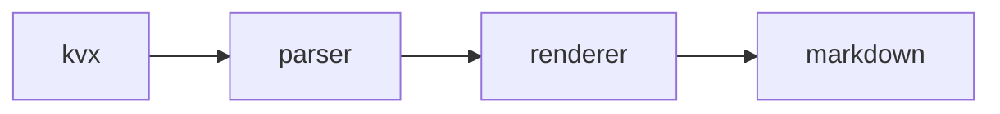

<!-- GENERATED by cg spec render from spec/ kvx — DO NOT EDIT. -->

The engine parses kvx into an ordered document and renders it.

## Notes

- ordered sections
- surgical writes

Scalar paragraphs are emitted verbatim.

# Design

The included body supplies its own H1, so the renderer must not emit a
duplicate title.

